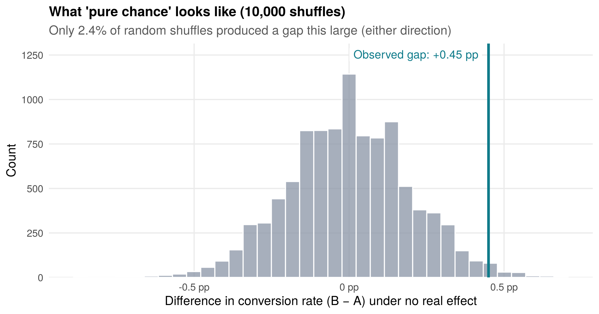
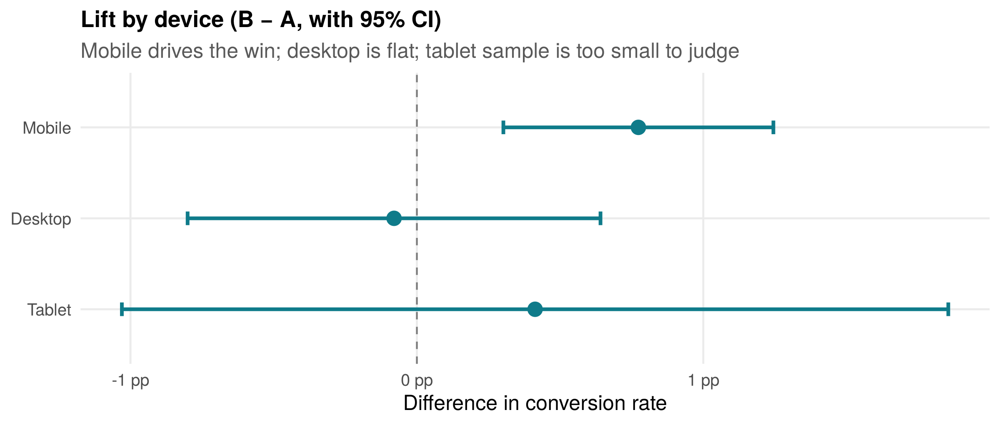
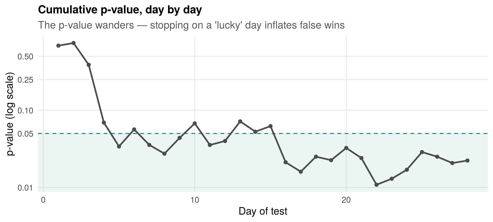

# Did the New Landing Page Really Win? - A/B Test Analysis in R

**Question:** An online *Excel: Beginner to Advanced* course tested a redesigned landing page (B) against the current one (A). B got more sign-ups - but was that a real improvement, or just luck?

**Short answer:** The lift is real (≈99% probability B is better), but it comes almost entirely from **mobile** visitors, and B's effect on **revenue** is not yet proven. Ship B to mobile, keep testing on desktop, and fix the upsell before forecasting revenue.

📄 **[View the full interactive report](https://manjirigajmal.github.io/ab-test-analysis-r/ab_test_report.html)**

---

## Key results

| Metric | A (control) | B (new page) | Verdict |
|---|---|---|---|
| Visitors | 14,505 | 14,400 | Split is healthy (SRM p = 0.54) |
| Conversion rate | 2.66% | 3.11% | **+16.9% lift, p = 0.022** |
| 95% CI for lift | | | +2% to +34% — real, but wide |
| P(B better than A) — Bayesian | | | **98.9%** |
| Mobile conversion | 2.09% | 2.87% | **+37%, Holm-adjusted p = 0.004** |
| Desktop conversion | 3.62% | 3.54% | No change |
| Revenue per visitor | $2.04 | $2.18 | Not significant (p = 0.40) |
| Pro bundle share of buyers | 34.7% | 26.3% | B pushes buyers to the cheaper plan |





## What makes this analysis different

Most A/B write-ups stop at one p-value. This one asks *"was it chance?"* five different ways, and checks the traps that cause false wins in real businesses:

1. **Power analysis first** - the sample size was planned before the test (13,914 per arm for a +20% lift at 80% power).
2. **Sample Ratio Mismatch check** - a broken 50/50 split invalidates everything downstream.
3. **Two-proportion z-test** with a **bootstrap CI** for relative lift.
4. **Permutation test** - shuffles the A/B labels 10,000 times to show what pure chance looks like, with no distributional assumptions.
5. **Bayesian Beta-Binomial model** - answers the question managers actually ask: *"How likely is B better, and what do we lose if we're wrong?"*
6. **Revenue per visitor** with Welch's t-test and bootstrap - catches the trap of declaring a revenue win off a conversion win.
7. **Logistic regression** controlling for device, channel, new/returning visitors and weekends.
8. **Segment analysis with Holm correction** + a formal interaction test - avoids data-dredging.
9. **The peeking trap** — 2,000 simulated A/A tests show that checking results daily and stopping at the first p < 0.05 raises false "winners" from **4.4% to 23%** (~5×).
10. **Business impact** translated into extra enrolments and revenue range per month.



## Project structure

```
├── R/01_simulate_data.R        # Generates the dataset (reproducible, seed = 182)
├── data/ab_test_landing_page.csv   # 28,905 visitor-level rows
├── ab_test_report.Rmd          # Full analysis (R Markdown)
├── ab_test_report.html         # Rendered report
└── images/                     # Charts used in this README
```

## Run it yourself

```r
install.packages(c("dplyr", "ggplot2", "scales", "tidyr", "rmarkdown"))
source("R/01_simulate_data.R")              # optional: regenerates the data
rmarkdown::render("ab_test_report.Rmd")     # ~30 seconds
```

## About the data

The dataset is **synthetic**, so the full methodology can be shared publicly. It was built to behave like real traffic: weekday/weekend swings, a realistic device and channel mix, skewed order values ($49 Standard / $129 Pro), and a treatment effect that differs by device.

Because the data is simulated, the "true" answer is known — which makes it a useful check that the methods work. B was designed with an average lift of roughly +17% (concentrated on mobile, near-zero on desktop), and the analysis recovered exactly that pattern. Across 300 simulated repeats of this experiment, the median observed lift was +17.3%; this dataset's +16.9% is representative, not cherry-picked. Those repeats also showed a test of this size detects an effect of this size about 69% of the time — a reminder that a non-significant result is not proof of "no effect".

## Tools

R · dplyr · ggplot2 · tidyr · scales · R Markdown

---

**Manjiri Gajmal** — Freelance Data Scientist · R & Excel Trainer
[LinkedIn](https://www.linkedin.com/in/manjirigajmal) · [Portfolio](https://datascienceportfol.io/careermanjiri)
